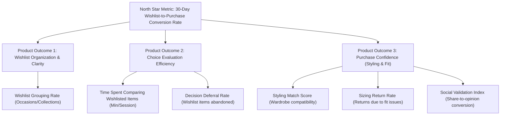

# Product Problem Statement: Myntra Wishlist-to-Purchase Conversion

## 1. Executive Summary
*   **Company & Product:** Myntra (Growth Team)
*   **Core Goal:** Increase the percentage of users who purchase at least one item from their wishlist within 30 days of adding it, without relying on monetary incentives (coupons/discounts).
*   **Focus Area:** Resolving **Comparison Paralysis** and **Styling Uncertainty** for trend-conscious shoppers.

---

## 2. Target User Segment
*   **Demographics:** Gen-Z and Young Millennials (aged 18–28) living in Tier 1 and Tier 2 cities in India.
*   **Behavioral Characteristics:**
    *   Frequent browsers who use the wishlist as a digital wardrobe, bookmarking items daily.
    *   Highly influenced by social media trends (Instagram Reels, Pinterest, YouTube fashion creators).
    *   Value styling and outfit coordination over single-item purchases.
    *   Highly price-sensitive but also value-sensitive; they search for the "best value" rather than just the cheapest option.
    *   Experience cognitive fatigue due to the sheer volume of options (Myntra has hundreds of thousands of active listings).

---

## 3. Metric Decomposition (Business to Product Outcomes)

We decompose the high-level business metric into measurable user behaviors:

### Formulaic Breakdown
$$\text{Wishlist-to-Purchase Conversion Rate} = \text{Wishlist Traffic} \times \text{Decision Confidence Index} \times (1 - \text{Comparison Paralysis Rate})$$

To improve the business metric without discounts, we must:
1.  **Reduce Comparison Paralysis:** Help users choose the "best" item from their shortlisted alternatives.
2.  **Increase Decision Confidence:** Help users visualize how the item fits their personal style and coordinate it with other products.

---

## 4. Root Causes of Wishlist Abandonment (The "Why")

Based on the synthesis of user reviews, social media discussions, and primary interviews:

1.  **Choice Overload & Comparison Fatigue (The "Cluttered Closet" Effect):**
    *   Users treat the wishlist as a bookmarking dump. Over time, it accumulates dozens of similar products (e.g., 6 light blue straight-fit jeans).
    *   The standard wishlist UI is a vertical scroll of card images. There is no simple way to compare fabric weight, fit, customer-voted sizing accuracy, real customer images, or return rates side-by-side.
    *   *Result:* Users get overwhelmed and close the app.
2.  **Wardrobe Integration & Styling Anxiety ("What do I wear it with?"):**
    *   Users like an item in isolation but cannot picture how to style it with clothes they already own or with other items they want to buy.
    *   They hesitate because they don't want to buy a t-shirt only to realize they have no matching trousers, requiring another purchase or a return.
    *   *Result:* Purchase is postponed indefinitely.
3.  **Sizing and Quality Anxiety ("Will it look cheap or fit poorly?"):**
    *   Shoppers worry about returning items due to sizing discrepancies. Even though returns are free, the hassle of repacking and waiting for pickups causes purchase friction.
    *   *Result:* Users wait until they have the energy to verify reviews or check third-party styling reviews on YouTube.

---

## 5. Existing User Workarounds
To solve these challenges today, users perform high-friction manual tasks outside the app:
*   **Screenshot & Compare:** Taking screenshots of multiple wishlisted items, placing them side-by-side in their phone gallery (or Canva) to see which one looks better.
*   **WhatsApp Consulting:** Sending screenshots of 3-4 items to friends/groups with the question *"Which one should I buy?"*, waiting hours for opinions.
*   **Manual Excel/Notes Sheets:** Copying links, prices, and sizes into a Notepad or Excel sheet to compare specifications, ratings, and pros/cons.
*   **Size Bracket Ordering:** Ordering the same item in sizes M and L simultaneously with the intention of returning one (costing Myntra logistics fees and tying up user capital).

---

## 6. Why Solving This Creates Value

### For the User:
*   **Saves Time & Cognitive Load:** Replaces manual screenshots and external sheets with a native, instant comparison studio.
*   **Reduces Purchase Regret:** Increases confidence that the item fits their style, matches their wardrobe, and has genuine peer/friend approval.
*   **Frictionless Decision Making:** Transitions the wishlist from a passive graveyard into an active, fun, and social shopping board.

### For the Business (Myntra):
*   **Direct Growth Metric Boost:** Converts high-intent wishlist items that would have otherwise expired or been forgotten, leading to immediate GMV (Gross Merchandise Value) lift.
*   **Zero Margin Erosion:** Drives conversion through UX utility and confidence, avoiding discount coupons that eat into profit margins.
*   **Lower Return Rates:** By matching outfits better and providing clearer comparative metrics, we reduce the rate of returns caused by "dislike of style" or "sizing errors".
*   **Increased Viral Acquisition / Social Traffic:** The shared voting/opinion links bring non-users or dormant users onto the Myntra platform to vote, acting as a low-cost organic loop.
