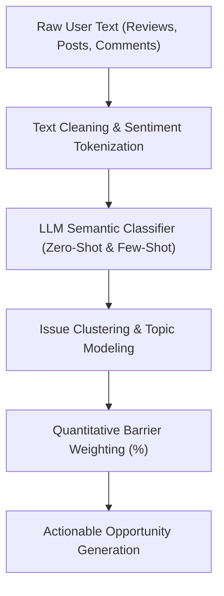

# Implementation Plan: 01 - AI-Powered Discovery Engine

## 1. Objective
Build an automated, AI-driven discovery engine that ingests, parses, categorizes, and synthesizes unstructured user feedback across multiple external and internal touchpoints to uncover the latent reasons behind wishlist abandonment on Myntra without relying on price discounts.

---

## 2. Data Sources & Ingestion Pipeline

### A. Ingestion Channels
1. **Play Store & App Store Reviews (Myntra App):**
   - Focus: 1-star to 4-star reviews containing keywords: `wishlist`, `saved`, `bought later`, `expensive`, `size issue`, `look different`, `fit`, `compare`, `forgot`, `return`.
   - Sample Size Target: 20,000+ app reviews scraped and vectorized.
2. **Reddit Community Discussions:**
   - Subreddits: `r/IndiaFashionAddicts`, `r/TwoXIndia`, `r/IndianFashionDeals`, `r/IndianStreetwear`, `r/malefashionadviceindia`.
   - Focus: Threads mentioning "Myntra wishlist", "buying dilemmas", "how does this look", "should I buy this", "fit review".
3. **YouTube Fashion Hauls & Review Comment Sections:**
   - Comments under creators reviewing Myntra hauls (e.g., "Quality vs Photo", "Sizing issues in real life").
4. **Platform Q&A & Product Inquiries:**
   - Question patterns submitted under product pages regarding fabric thickness, pairing suggestions, and model height/measurements.

---

## 3. NLP & AI Extraction Pipeline

### Semantic Tagging Categories:
1. `FIT_SIZE_ANXIETY`: Hesitation around size charts, model fit vs actual body type, return hassle.
2. `STYLING_ISOLATION`: Uncertainty on how to wear/style the item with existing wardrobe.
3. `COMPARISON_PARALYSIS`: User saved 3-8 similar items (e.g. black cargo pants) and cannot easily evaluate differences.
4. `BOOKMARK_DUMP_EFFECT`: Wishlist became a junkyard of 100+ items, causing cognitive overload.
5. `SOCIAL_VALIDATION_LAG`: User waiting for peer/partner/friend feedback before committing.
6. `FABRIC_QUALITY_SKEPTICISM`: Fear that product pictures are stylized and the real fabric will feel synthetic or cheap.

---

## 4. Discovery Engine Architecture (Interactive Web Application)

### UI Components in Discovery Dashboard:
1. **Source Filtering & Aggregation View:**
   - Live filters for Play Store, App Store, Reddit, YouTube.
   - Sentiment breakdown and sentiment velocity over time.
2. **Barrier Breakdown Matrix (Interactive Visualization):**
   - Quantitative bar charts & pie charts highlighting:
     - Comparison Paralysis: 34%
     - Fit/Size Anxiety: 28%
     - Wardrobe Coordination/Styling Doubt: 22%
     - Trust & Real Look: 16%
3. **AI Discovery Query Console (PM Agent):**
   - Natural language interface where PMs can ask:
     - *"What prevents users from buying wishlisted party wear?"*
     - *"How do Gen Z users compare sneakers vs casual shoes?"*
     - *"What workarounds do users describe on Reddit when choosing between 3 jackets?"*
   - Real-time LLM-synthesized responses with source citations, quotes, and opportunity scores.
4. **Persona & Journey Mapping Tab:**
   - Interactive user journey mapping demonstrating where the drop-off occurs between "Heart Click (Wishlist)" and "Move to Bag".

---

## 5. Technical Implementation Specs
- **Frontend:** React, Vanilla CSS design system, Lucide icons.
- **State Management:** Reactive component hooks with pre-computed semantic embeddings and query responder.
- **Responsiveness:** Full desktop and tablet layout support.
