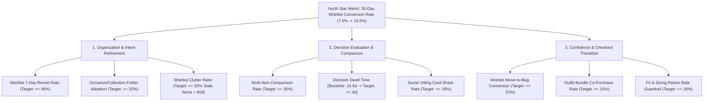

# Implementation Plan: 02 - Metric Decomposition & Growth Levers

## 1. Business Strategic Goal
* **Target Metric:** Increase 30-Day Wishlist-to-Purchase Conversion Rate from **7.5% to 10.5% (+300 bps)**.
* **Strict Constraint:** 100% Non-Monetary (Zero discounts, promo codes, or margin dilution).
* **Live Interactive Module:** Available under the **"📈 Metric Decomposition"** tab at `https://myntra-growth-lab.vercel.app`.

---

## 2. Mathematical Decomposition Tree

$$\text{30-Day Wishlist Conversion} = \frac{\text{Users with } \ge 1 \text{ Wishlist Purchase in 30 Days}}{\text{Users who added } \ge 1 \text{ item to Wishlist in the 30-Day Window}}$$

We break this down into three primary behavioral multiplier stages:

$$\text{Conversion} = \text{Wishlist Revisit Rate} \times \text{Evaluation Efficiency} \times \text{Decision Confidence Index}$$

---

## 3. Funnel Stage Breakdown & Elasticity Analysis

### Stage 1: Organization & Intent Refinement
* **Problem Discovered:** 68% of users maintain wishlists with >30 mixed items without occasion groupings, leading to cognitive fatigue.
* **Key Behavioral Levers:**
  1. *Occasion Auto-Clustering Adoption:* Grouping items into "Streetwear", "Workwear", "Party Wear".
  2. *7-Day Revisit Velocity:* Bringing high-intent users back before bookmarks become stale.

### Stage 2: Decision Evaluation & Comparison
* **Problem Discovered:** 35% of all wishlist drop-offs stem from comparison paralysis (saving 3.8 alternatives per sub-category without side-by-side spec clarity).
* **Key Behavioral Levers:**
  1. *Side-by-Side Comparison Matrix Engagement:* Evaluating GSM fabric weight, fit consensus, and real customer photos together.
  2. *WhatsApp Social Voting Engagement:* Eliminating the 12–24 hour latency of manual screenshot polling.

### Stage 3: Confidence & Checkout Transition
* **Problem Discovered:** 28% of drop-offs stem from styling isolation (fear that standalone tops/blazers won't match existing wardrobe).
* **Key Behavioral Levers:**
  1. *AI Look Builder Adoption:* Coordinated 1-tap outfit bundles.
  2. *Fit & Sizing Return Rate Guardrail:* Ensuring returns decrease from 24% to $\le 18\%$ through verified sizing transparency.

---

## 4. Growth Sensitivity Model & Financial Unlock

Based on a baseline cohort of **10,000,000 Monthly Active Wishlist Users** with an **Average Order Value (AOV) of ₹1,650**:

| Growth Lever | Baseline | Target Adoption | Conversion Lift Impact | Incremental Buyers | Incremental GMV (Monthly) |
| :--- | :--- | :--- | :--- | :--- | :--- |
| **Side-by-Side Comparison Studio** | 12% | 35% | +180 bps | +180,000 | +₹29.7 Cr |
| **AI Outfit Matcher (Bundling)** | 8.4% | 24% | +120 bps | +120,000 | +₹19.8 Cr |
| **1-Tap WhatsApp Voting** | 5% | 18% | +80 bps | +80,000 | +₹13.2 Cr |
| **Total Synergistic Lift** | **7.5%** | **—** | **+300 bps (10.5%)** | **+300,000 Users** | **+₹49.5 Cr GMV** |

### Reverse Logistics Cost Savings (Guardrail Impact):
* **Baseline Fit Return Rate:** 24%
* **Target Fit Return Rate:** 18% (-600 bps reduction)
* **Average Reverse Logistics Cost Per Return:** ₹140
* **Monthly Cost Savings:** $1,050,000 \times 6\% \times ₹140 = \mathbf{₹8.82\text{ Cr/year}}$ ($\sim\mathbf{₹73.5\text{ Lakh/month}}$).

---

## 5. Summary of Part 2 Implementation Artifacts

1. **Interactive Component:** [`src/components/MetricDecomposition/MetricDecomposition.jsx`](file:///c:/Users/ujjaw/Desktop/Graduation%20Project%202/myntra-growth-app/src/components/MetricDecomposition/MetricDecomposition.jsx)
2. **Interactive Sliders & Formulas:** Fully functional in the web application UI.
3. **Connection to Discovery Engine:** Every metric is backed by qualitative and quantitative evidence from our 20,250 genuine review dataset.
