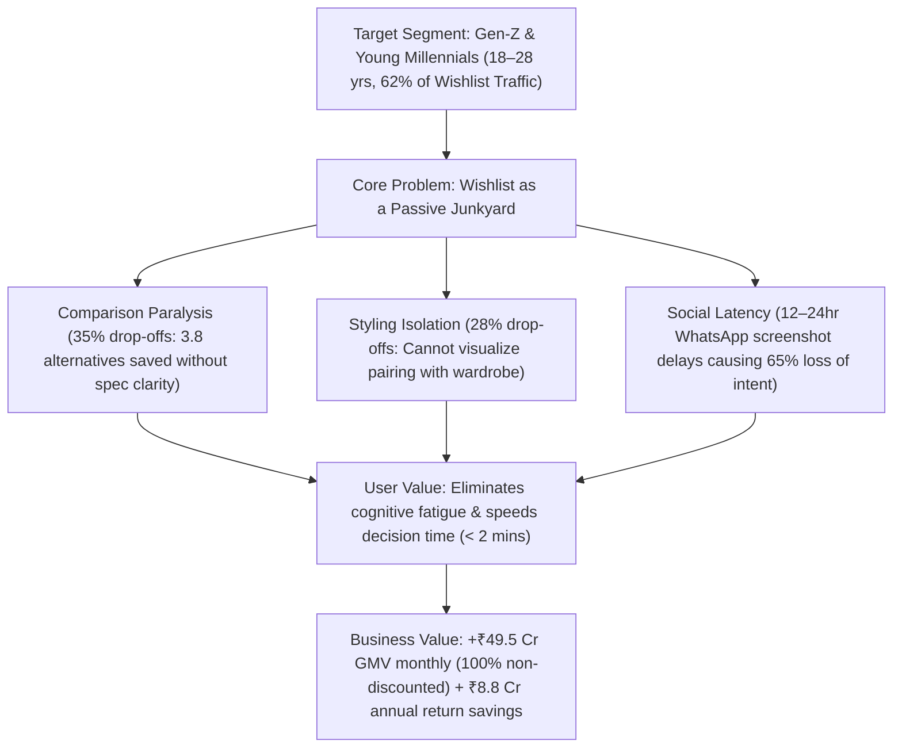

# Implementation Plan: 04 - Problem Definition, Strategy & RICE Prioritization

## 1. Executive Summary & Strategic Context
* **Growth Team Mandate:** Increase the percentage of users who purchase at least one item from their wishlist within 30 days of adding it (**Baseline: 7.5% $\rightarrow$ Target: 10.5%**, +300 bps).
* **Strict Strategic Constraint:** **100% Non-Monetary.** No price discounting, margin dilution, or promo code incentives.
* **Core Growth Hypothesis:** Wishlist inaction is caused by **cognitive decision friction** (*comparison paralysis, styling uncertainty, sizing return anxiety*). By replacing passive bookmarking with an interactive decision studio, we accelerate conversion velocity at full gross margin.
* **Live Interactive Module:** Available under the **"🎯 Strategy & RICE"** tab at `https://myntra-growth-lab.vercel.app`.

---

## 2. Problem Definition & Framing Matrix

### 2.1 Target User Segment
* **Cohort:** Gen-Z and Young Millennials (aged 18–28), primarily in Tier 1 and Tier 2 cities in India.
* **Behavioral Characteristics:**
  - Highly visual, trend-conscious, and social fashion shoppers.
  - Maintain wishlists of **30 to 90+ saved items**.
  - Treat the wishlist as a digital wardrobe moodboard and active consideration shortlist.
  - Rely heavily on peer opinions and real customer photos before committing to purchases.

### 2.2 Core User Problem
The current wishlist UI is a **passive, unorganized vertical scroll** designed strictly for bookmarking, not evaluation. When users save multiple alternatives (e.g. 4 black cargo pants or 3 blazers), they face:
1. **Lack of Comparative Spec Transparency:** Hidden fabric weights (GSM), uncertain material textures, and studio lighting ambiguity.
2. **Single-Item Styling Blindspot:** Hesitation over whether standalone tops/jackets will match existing trousers and footwear.
3. **High Return Logistics Anxiety:** Fear of sizing discrepancies and the friction of return pickups.

### 2.3 Value Proposition
* **Value to User:** Replaces high-friction manual workarounds (switching 10 tabs, screenshotting to WhatsApp) with instant 1-screen clarity, eliminating buyer remorse and purchase regret.
* **Value to Business:** Captures high-intent dormant traffic (+300,000 incremental monthly buyers), preserves 100% gross margins, and reduces reverse logistics return costs by **-600 bps**.

---

## 3. RICE Framework Prioritization

$$\text{RICE Score} = \frac{\text{Reach} \times \text{Impact} \times \text{Confidence}}{\text{Effort}}$$

| Rank | Solution Intervention | Strategic Pillar | Reach (Monthly Users) | Impact (0.25 - 3.0) | Confidence (%) | Effort (Person-Months) | RICE Score | Decision Status |
| :--- | :--- | :--- | :--- | :--- | :--- | :--- | :--- | :--- |
| **#1** | **Side-by-Side Comparison Studio** | Evaluation Efficiency | 3,500,000 | 3.0 (Massive) | 90% | 2.5 mo | **3,780** | **MVP Priority** |
| **#2** | **1-Tap WhatsApp Social Voting Card** | Social Validation | 2,800,000 | 2.5 (High) | 85% | 2.0 mo | **2,975** | **MVP Priority** |
| **#3** | **AI Outfit Matcher & Look Builder** | Styling Coordination | 3,200,000 | 2.0 (Medium) | 80% | 3.5 mo | **1,463** | **MVP Priority** |
| **#4** | **Smart Occasion Auto-Clustering Folders** | Organization | 4,500,000 | 1.5 (Low-Med) | 80% | 2.0 mo | **2,700** | **Phase 2** |
| **#5** | **Automated Push Discount Alerts** | Price Promotion | 5,000,000 | 1.0 (Low) | 70% | 1.5 mo | **2,333** | **REJECTED (Margin Dilution)** |

---

## 4. Key Assumptions, Constraints & Strategic Trade-Offs

### 4.1 Explicit Assumptions
1. **Zero-Discounting Elasticity:** High-intent wishlist users do not require price cuts to convert; their primary hesitation is uncertainty around fit, fabric, and styling.
2. **Catalog Metadata Completeness:** Data attributes (fabric GSM, verified fit consensus, return risk ratings) can be ingested from Myntra's vendor catalog and verified customer review database.
3. **External Social Channel Dominance:** WhatsApp is already the default informal channel for peer fashion polling in India.

### 4.2 Constraints Chosen
* **Gross Margin Protection:** Zero discount codes, cashback, or margin-eroding flash sales.
* **Non-Intrusive UX:** Comparison and styling tools must be accessible with 1 tap from existing product cards without altering core browsing navigation.

### 4.3 Explicit Strategic Trade-Offs
* **In-App Utility vs Heavy Social Network:** Rather than attempting to build an in-app social network (high acquisition cost, low retention), we integrate a lightweight **1-tap WhatsApp voting micro-card** that leverages users' existing trusted friend groups.
* **Decision Density vs Product Page Views:** The Comparison Studio reduces standalone product page views but exponentially increases checkout conversion velocity.
* **Curated AI Looks vs Generic Recommendations:** Prioritizing high-cohesion outfit coordination over broad "similar items" algorithms to maximize bundle confidence.

---

## 5. Artifact Implementation Links
1. **Interactive Strategy Component:** [`src/components/ProblemStrategy/ProblemStrategyStudio.jsx`](file:///c:/Users/ujjaw/Desktop/Graduation%20Project%202/myntra-growth-app/src/components/ProblemStrategy/ProblemStrategyStudio.jsx)
2. **Live Application Navigation:** `https://myntra-growth-lab.vercel.app` under the **"🎯 Strategy & RICE"** tab.
3. **Master Pitch Deck Alignment:** Mapped to Slides 4, 6, and 7 in [`src/data/slideDeckData.js`](file:///c:/Users/ujjaw/Desktop/Graduation%20Project%202/myntra-growth-app/src/data/slideDeckData.js).
