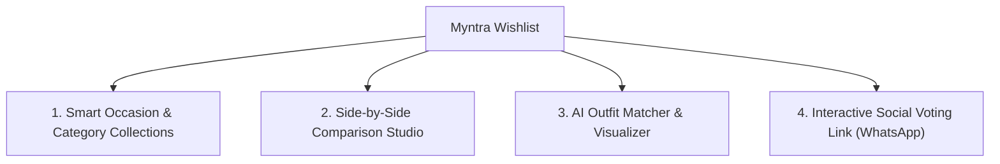

# Implementation Plan: 05 - MVP Architecture & Feature Specifications

## 1. MVP Concept: "Myntra Wishlist Studio"
A native, interactive decision studio integrated directly into the Myntra Wishlist experience that turns a cluttered list into an intelligent, visual, and collaborative shopping workspace.

---

## 2. Core Feature Specifications



### Feature 1: Smart Occasion & Category Collections
- **Functionality:** AI automatically clusters wishlisted items into dynamic cards:
  - *e.g., "Streetwear Essentials (5 items)", "Workwear & Office (4 items)", "Weekend Party (3 items)"*.
- **User Action:** Users can filter their cluttered list with 1 tap, eliminating cognitive overload.

### Feature 2: Side-by-Side Comparison Studio
- **Functionality:** Select 2 to 4 items in the same sub-category (e.g. 3 jackets).
- **Comparison Dimensions:**
  1. **Fit Confidence Rating:** User-aggregated consensus (e.g. *88% Say True to Size / Slim Fit*).
  2. **Fabric & Feel Transparency:** Material weight (GSM), stretchability, breathability score.
  3. **Verified Customer Real Photos:** Curated side-by-side gallery of non-model photos.
  4. **Return Friction Rating:** Lower return risk badge based on sizing consistency.
- **Outcome:** Decisive selection button: "Choose This One & Move to Bag".

### Feature 3: AI Outfit Matcher & Visualizer
- **Functionality:** Select any single wishlisted item (e.g., an Olive Bomber Jacket).
- **AI Styling Generator:**
  - Automatically fetches complementary items from the user's other wishlists or Myntra trending catalog.
  - Suggests 3 complete curated looks (e.g. *Casual Day Out, Friday Night, College Smart*).
  - Displays instant "Add Entire Look to Bag" or "Pair with existing wardrobe" guidance.

### Feature 4: Social Validation & WhatsApp Voting Card
- **Functionality:** 1-tap "Ask Friends" button generates a micro-voting preview card.
- **Experience:**
  - Shareable lightweight web link for WhatsApp / Instagram.
  - Friends can vote with 1 tap (*"Buy 1"*, *"Buy 2"*, *"Skip Both"*) and leave quick emojis.
  - Real-time vote counts sync directly into the user's Wishlist Studio.

---

## 3. Frontend Component Structure (React)

```
src/
├── components/
│   ├── Navigation/
│   │   └── HeaderNav.jsx         # App Switcher (Discovery Engine | Wishlist Studio MVP | Pitch Deck)
│   ├── DiscoveryEngine/
│   │   ├── ReviewAggregator.jsx  # Reviews, Reddit & YouTube synthesized data
│   │   ├── BarrierMetrics.jsx    # Chart visualizations of user friction
│   │   └── AIQueryConsole.jsx    # Interactive PM search/prompt simulator
│   ├── WishlistStudioMVP/
│   │   ├── WishlistHeader.jsx    # User profile & smart occasion chips
│   │   ├── ComparisonGrid.jsx    # Side-by-side product evaluator
│   │   ├── OutfitMatcher.jsx     # AI styling & look coordinator
│   │   └── SocialShareModal.jsx  # WhatsApp voting & peer feedback card
│   └── PitchDeck/
│       └── SlideDeckViewer.jsx   # 10-slide presentation renderer (14pt font compliance)
├── data/
│   ├── mockDiscoveryData.js      # Synthesized multi-channel research dataset
│   ├── mockWishlistProducts.js   # Rich fashion items with fit scores & real photos
│   └── slideDeckData.js          # Slide contents with message-driven titles
├── styles/
│   └── index.css                 # Comprehensive vanilla CSS design system
├── App.jsx                       # Main application shell with tab routing
└── main.jsx
```
