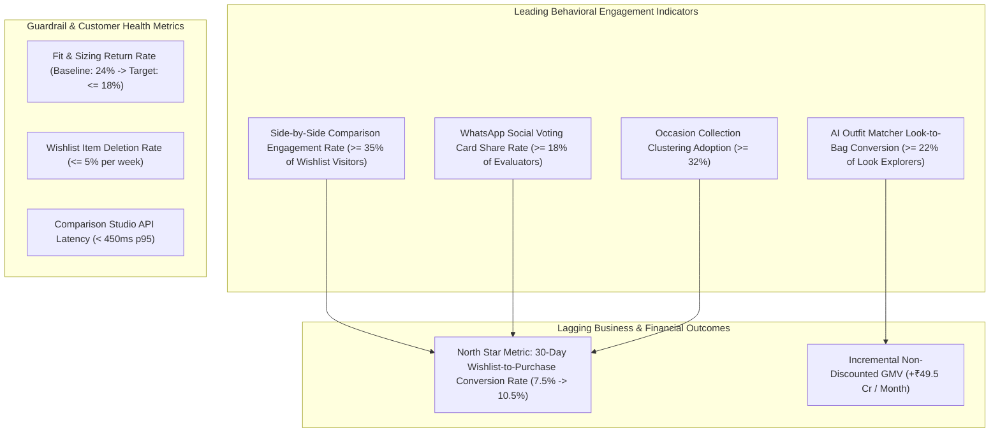

# Implementation Plan: 06 - Success Metrics & Evaluation Framework

## 1. Metrics Hierarchy Overview

* **Live Interactive Module:** Available under the **"📈 Success Metrics"** tab at `https://myntra-growth-lab.vercel.app`.

---

## 2. Detailed Metric Definitions, Formulas & Strategic Rationale

| Metric Name | Classification | Baseline | Target Goal | Formula / Calculation | Strategic PM Rationale |
| :--- | :--- | :--- | :--- | :--- | :--- |
| **30-Day Wishlist Conversion** | **North Star Metric** | 7.5% | **10.5% (+300 bps)** | $\frac{\text{Users purchasing } \ge 1 \text{ wishlisted item in 30 days}}{\text{Users who wishlisted } \ge 1 \text{ item in the same period}}$ | The direct growth mandate set by leadership: measures monetization of high-intent traffic without discounts. |
| **Incremental Non-Discounted GMV** | **Financial Output** | ₹0 | **+₹49.5 Cr / month** | $(\text{Variant Buyers} - \text{Control Buyers}) \times \text{AOV (₹1,650)}$ | Captures incremental revenue while guaranteeing 0% gross margin dilution. |
| **Comparison Studio Engagement** | **Leading Indicator** | 12% | **$\ge 35\%$ of Visitors** | $\frac{\text{Users launching Comparison Studio}}{\text{Total Wishlist Page Visitors}}$ | Validates that users are actively adopting evaluation tools to solve choice overload. |
| **AI Look-to-Bag Conversion** | **Leading Indicator** | 8.4% | **$\ge 22\%$ of Explorers** | $\frac{\text{Users adding complete look bundle to bag}}{\text{Users viewing AI coordinated looks}}$ | Proves that automated outfit coordination eliminates single-piece hesitation and drives bundle size. |
| **WhatsApp Social Voting Share Rate** | **Leading Indicator** | 5.0% | **$\ge 18\%$ of Sessions** | $\frac{\text{Voting links shared to WhatsApp}}{\text{Sessions comparing } \ge 2 \text{ items}}$ | Measures adoption of the peer-validation viral loop. |
| **Fit & Sizing Return Rate** | **Core Guardrail** | 24.0% | **$\le 18.0\%$ (-600 bps)** | $\frac{\text{Returns due to fit/fabric mismatch}}{\text{Total items delivered from wishlist}}$ | **CRITICAL GUARDRAIL:** Ensures conversion lift is driven by genuine fit confidence rather than rushed impulse buys. |
| **Wishlist Item Deletion Rate** | **UX Guardrail** | 4.2% / wk | **$\le 5.0\%$ / wk** | $\frac{\text{Items deleted from wishlist}}{\text{Total active wishlist inventory}}$ | Guarantees users do not experience cognitive clutter or purge saved items. |
| **API Latency (p95)** | **Tech Guardrail** | 320 ms | **$< 450\text{ ms (p95)}$** | Time to render side-by-side spec cards and customer photos | Ensures fast, responsive performance across 4G/5G mobile networks. |

---

## 3. A/B Testing Cohort Experimentation Architecture

### 3.1 Experiment Setup & Sizing
* **Target Audience:** All active Myntra mobile app users with $\ge 3$ wishlisted items.
* **Allocation:** 50% Control ($N = 100,000$ users) vs 50% Variant ($N = 100,000$ users).
* **Test Duration:** 30 Full Days (to capture full natural conversion consideration latency and monthly salary cycles).
* **Statistical Rigor:**
  - $\alpha = 0.05$ ($95\%$ Confidence Level).
  - Statistical Power ($1 - \beta$) = $80\%$.
  - Minimum Detectable Effect (MDE): $\pm 0.5\%$ absolute lift.

### 3.2 Cohort Experience Breakdown
* **Control Group (50%):** Standard Myntra Wishlist UI (vertical scroll, static bookmarking cards, no comparison tool, no AI look generator).
* **Variant Group (50%):** Myntra Wishlist Studio (Smart Occasion Folders, Side-by-Side Spec & Photo Matrix, AI Outfit Matcher, 1-Tap WhatsApp Voting Cards).

### 3.3 Go / No-Go Decision Rollout Framework
1. **Full Rollout (100% Traffic):** Variant achieves statistically significant conversion lift $\ge +150\text{ bps}$ ($p < 0.05$) AND Fit Return Rate remains $\le 19.0\%$.
2. **Iterate & Refine:** Conversion lift between $+50$ to $+150\text{ bps}$; refine AI Look styling recommendations and improve comparison matrix discoverability.
3. **Rollback / Kill:** Sizing returns spike $> 24\%$ OR 30-day conversion is neutral/negative.

---

## 4. Telemetry & Analytics Event Tracking Dictionary

| Event Name | Trigger Condition | Key Event Properties |
| :--- | :--- | :--- |
| `wishlist_studio_launched` | User clicks 'Launch Comparison' or selects an occasion filter | `user_id`, `occasion_category`, `shortlisted_count`, `session_dwell_time` |
| `spec_comparison_viewed` | User compares 2-4 items side-by-side | `product_ids`, `fabric_gsm_viewed`, `fit_consensus_score`, `photos_cycled` |
| `ai_outfit_look_explored` | User clicks 'AI Outfit Matcher' on any piece | `base_product_id`, `look_theme`, `bundle_price`, `look_index` |
| `bundle_moved_to_bag` | User clicks 'Add Complete Look to Bag' | `base_product_id`, `paired_product_ids`, `bundle_value`, `discount_applied: 0` |
| `social_poll_card_generated`| User generates WhatsApp voting card link | `option_a_id`, `option_b_id`, `channel: whatsapp`, `poll_id` |
| `social_poll_vote_submitted`| Friend submits a vote on the shared card | `poll_id`, `voted_option`, `response_latency_seconds` |

---

## 5. Summary of Implementation Artifacts
1. **Interactive Dashboard Component:** [`src/components/SuccessMetrics/SuccessMetricsStudio.jsx`](file:///c:/Users/ujjaw/Desktop/Graduation%20Project%202/myntra-growth-app/src/components/SuccessMetrics/SuccessMetricsStudio.jsx)
2. **Master Plan:** [`plans/06_success_metrics_and_evaluation_plan.md`](file:///c:/Users/ujjaw/Desktop/Graduation%20Project%202/plans/06_success_metrics_and_evaluation_plan.md)
3. **Presentation Deck Alignment:** Directly reflected in Slide 9 of the pitch deck ([`src/data/slideDeckData.js`](file:///c:/Users/ujjaw/Desktop/Graduation%20Project%202/myntra-growth-app/src/data/slideDeckData.js)).
