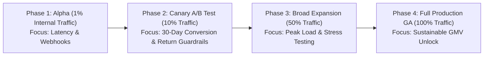

# Implementation Plan: 07 - Risks, Failure Modes & Mitigation Plan

## 1. Risk Management Framework Overview
To protect user trust, catalog integrity, and conversion velocity, we have identified **5 critical failure modes** across algorithms, user behavior, catalog supply, and UX, paired with proactive mitigations and automated circuit breakers.

* **Live Interactive Module:** Available under the **"🛡️ Risks & Guardrails"** tab at `https://myntra-growth-lab.vercel.app`.

---

## 2. 5 Critical Failure Modes & Proactive Mitigations Matrix

| Risk ID & Category | Failure Mode Description | Probability / Severity | Proactive Architectural Mitigation Strategy | Automated Guardrail Metric |
| :--- | :--- | :--- | :--- | :--- |
| **Risk 1: AI Quality** | **AI Styling Mismatch & Clashing Looks:** Generative AI suggests mismatched aesthetics (e.g. heavy winter coat with beach sandals) or clashing colors, eroding styling trust. | **Medium / High** | **Curated Fashion Knowledge Graph Rule Layer:** All model recommendations pass through deterministic taxonomy rules (Color Theory, Seasonality, Occasion Matrix) before rendering. | Look Quality Approval Score $\ge 92\%$ |
| **Risk 2: Behavior** | **Social Voting Async Latency:** Users share WhatsApp voting cards but friends take 12–24 hours to reply, causing shopping impulse to fade (65% drop-off). | **High / Medium** | **Instant AI Community Consensus Fallback:** Instant score displayed immediately on poll creation (*"78% of shoppers with your style preference chose Option A"*) so users can decide without waiting. | Instant Decision Rate $\ge 45\%$ |
| **Risk 3: Catalog** | **Missing Catalog Metadata (GSM / Fit):** Third-party brand sellers fail to input fabric GSM weights or fit specs, creating blank rows in comparison matrices. | **Medium / Medium** | **Automated Review NLP Extraction & ERP Backfill:** Extract specs from verified customer review sentiment (*"Fabric feels thick"*, *"Runs small"*) + mandate GSM for top 500 brand SKUs. | Catalog Metadata Coverage $\ge 95\%$ |
| **Risk 4: UX & UI** | **Cognitive UI Overload & Clutter:** Adding buttons and matrices makes the wishlist feel too heavy or cluttered for casual bookmarkers. | **Low / High** | **Progressive Disclosure Dock:** The wishlist remains clean. Comparison Matrix only activates via a non-intrusive bottom dock when 2+ items in a category are selected. | Wishlist Item Deletion Rate $\le 5\%$/wk |
| **Risk 5: Inventory** | **Size Stockout During Evaluation Dwell:** While users spend 2–3 days comparing items, their preferred size goes out of stock, triggering abandonment. | **Medium / High** | **Real-Time Urgency Badges & 1-Click Substitution:** Display *"Only 2 left in Size M"* in comparison view + provide 1-click instant alternative match with identical specs. | Stockout Cart Loss $\le 4\%$ |

---

## 3. Phased Canary Rollout & Automated Circuit Breakers

### 3.1 Rollout Stages Breakdown
1. **Phase 1: Alpha Testing (1% Traffic, 1 Week):**
   - Internal employees and top 1,000 power shoppers.
   - *Exit Gate:* Zero critical crash bugs, p95 API latency $< 350\text{ms}$.
2. **Phase 2: Canary Cohort A/B Test (10% Traffic, 4 Weeks):**
   - 50,000 Control vs 50,000 Variant users over a 30-day cohort.
   - *Exit Gate:* Statistically significant conversion lift $\ge +150\text{ bps}$ ($p < 0.05$) AND Fit Returns $\le 19.0\%$.
3. **Phase 3: Broad Expansion (50% Traffic, 2 Weeks):**
   - Stress testing backend recommendation APIs under high-concurrency traffic.
   - *Exit Gate:* Server error rate $< 0.05\%$, CPU utilization $< 60\%$.
4. **Phase 4: Full Production Rollout (100% Traffic, Ongoing):**
   - General availability across all iOS, Android, and Web users.
   - Continuous tracking of **+₹49.5 Cr monthly non-discounted GMV**.

### 3.2 Automated Rollback Circuit Breakers
If during any phase:
- **Fit & Sizing Returns exceed $24\%$**, OR
- **Comparison API p95 response time spikes $> 800\text{ms}$**, OR
- **Wishlist item deletion rate spikes $> 8\%$**,

$\rightarrow$ The dynamic feature flag will **automatically disable the Comparison Studio and AI Look Builder**, safely routing users back to the baseline wishlist UI within **60 seconds** without requiring an app store update.

---

## 4. Summary of Implementation Artifacts
1. **Interactive Component:** [`src/components/RisksMitigations/RisksMitigationsStudio.jsx`](file:///c:/Users/ujjaw/Desktop/Graduation%20Project%202/myntra-growth-app/src/components/RisksMitigations/RisksMitigationsStudio.jsx)
2. **Master Plan Document:** [`plans/07_risks_and_mitigation_plan.md`](file:///c:/Users/ujjaw/Desktop/Graduation%20Project%202/plans/07_risks_and_mitigation_plan.md)
3. **Pitch Deck Alignment:** Mapped to Slide 10 in [`src/data/slideDeckData.js`](file:///c:/Users/ujjaw/Desktop/Graduation%20Project%202/myntra-growth-app/src/data/slideDeckData.js).
